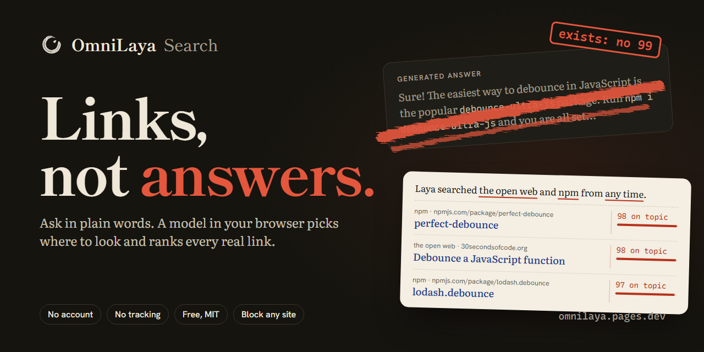
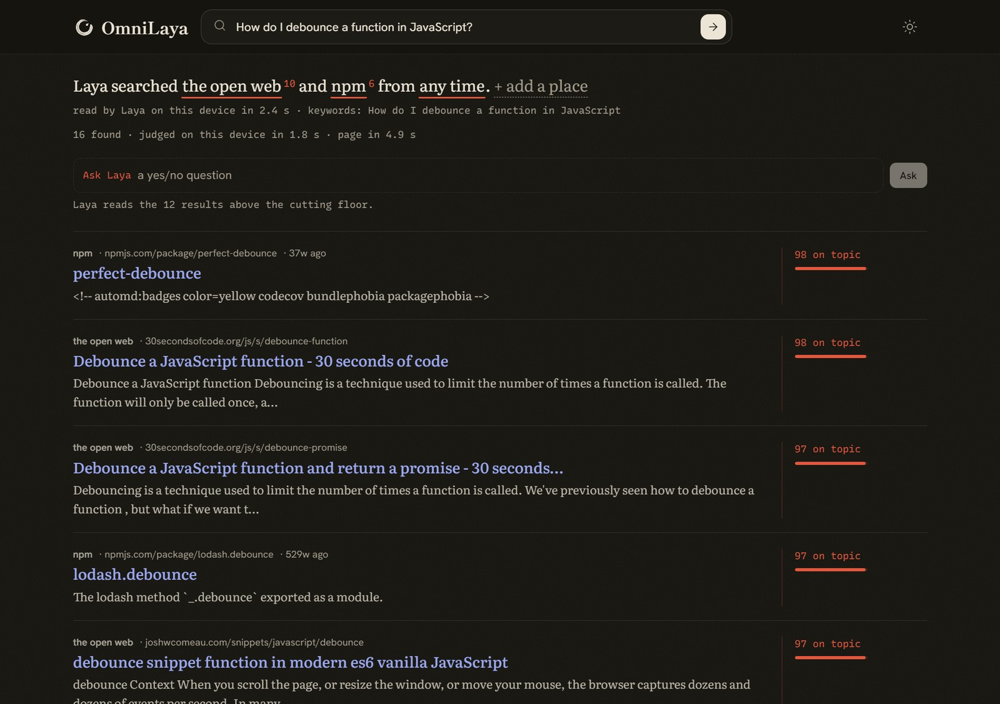
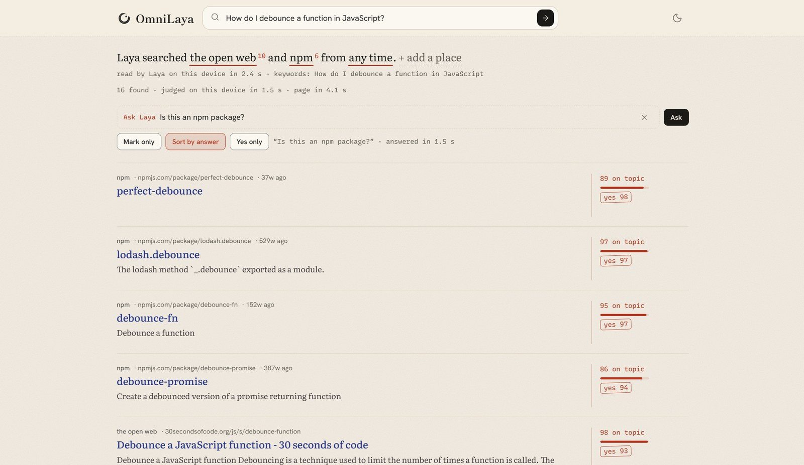
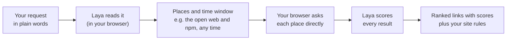

<p align="center">
  <a href="https://omnilaya.pages.dev/">
    <picture>
      <source media="(prefers-color-scheme: dark)" srcset="brand/logo/mark-wash-on-night.svg">
      
    </picture>
  </a>
</p>

<h1 align="center">OmniLaya Search</h1>

<p align="center">
  <b>Links, not answers.</b><br>
  Search that runs a small model in your browser to pick where to look and rank every link.<br>
  No AI answer, no account, no tracking.
</p>

<p align="center">
  <a href="https://omnilaya.pages.dev/"></a>
  <a href="https://github.com/Hotragn/Omni-Laya/actions/workflows/ci.yml"></a>
  <a href="LICENSE"></a>
  
  <a href="https://github.com/Hotragn/Omni-Laya/stargazers"></a>
</p>

<p align="center">
  <a href="https://omnilaya.pages.dev/"><b>Try it</b></a> ·
  <a href="#why-omnilaya">Why</a> ·
  <a href="#what-you-get">What you get</a> ·
  <a href="#quick-start">Quick start</a> ·
  <a href="#how-it-works">How it works</a> ·
  <a href="#how-it-compares">How it compares</a> ·
  <a href="#faq">FAQ</a>
</p>

<p align="center">
  <a href="https://omnilaya.pages.dev/"></a>
</p>

## Why OmniLaya

Search pages and chat tools now put a generated answer first. When you need the actual page (the docs, the repo, the package, the thread), you still have to dig for the link and check whether it is real.

- In Pew's 2025 study, people clicked a search result on 8% of visits when Google showed an AI summary, against 15% without one. They clicked a link inside the summary on 1% of visits ([Pew Research](https://www.pewresearch.org/short-reads/2025/07/22/google-users-are-less-likely-to-click-on-links-when-an-ai-summary-appears-in-the-results/)).
- For code it is riskier. A 2024 study found that at least 5.2% of packages suggested by commercial code models, and 21.7% by open-source ones, did not exist ([Spracklen et al.](https://arxiv.org/abs/2406.10279)). Anyone can register those names and publish code under them.

What developers keep asking for is simple: *just give me the links*, let me block sites I do not trust, and do not make me sign up or pay. OmniLaya does exactly that, and does the whole job inside your browser tab.

## What you get

**Ask in plain words. Laya picks the places and scores every link.** Every choice Laya makes is underlined and can be changed in one tap: strike a place, add one, change the time window. Its scores sit in the margin, never inside the result.

<p align="center"></p>

**Ask a yes or no question about every result.** "Is this an npm package?", "Is this official documentation?", "Is this a tutorial?". Laya stamps each result with its answer, and you can sort by it or keep only the yeses.

<p align="center"></p>

| | |
| --- | --- |
| **Just the links** | No generated answer, so there is nothing made up to check. You read the sources and judge them yourself. |
| **The right places, picked for you** | The open web ([Mwmbl](https://mwmbl.org)), GitHub, npm, Stack Overflow, Hacker News, research papers ([OpenAlex](https://openalex.org)), Open Library and Wikipedia. A package or repo in the results is a real entry from that registry. |
| **You set the rules** | Block, raise or lower any site, and it stays that way for every search. Move the cutting floor to hide results below a score you choose. |
| **Mark Laya wrong** | A disagree stamp on any result. Your marks stay in your browser and export as JSONL, ready to use as training data. |
| **Keyboard first** | `j` `k` move, `o` opens, `x` folds, `d` disagrees, `e` edits the sentence, `/` asks. |
| **Private by design** | Laya runs in your tab and your browser calls the sources directly. There is no OmniLaya server, account, cookie or analytics. |
| **Free and yours** | Static files under the MIT license. Anyone can host a copy on any static host. |

## Quick start

### Use it

Open **[omnilaya.pages.dev](https://omnilaya.pages.dev/)** and search. Searches work right away by rule. Click **Bring Laya to this device** once (614 MB with WebGPU), and from then on Laya reads every request and scores every result on your machine. Closing the tab keeps it; the next visit loads it from the browser cache in seconds. You can remove it any time with **remove Laya**.

### Run it locally

Requires Node.js 22.12+ and pnpm.

```bash
git clone https://github.com/Hotragn/Omni-Laya.git
cd Omni-Laya
corepack enable
pnpm install
pnpm dev:local        # http://localhost:3040
```

No API keys, no model server, no environment file.

### Host your own copy

```bash
SITE_URL=https://search.example.com/ pnpm build:local   # static site in dist-local/
```

Upload `dist-local/` to any static host. `SITE_URL` makes share cards, the canonical link and the sitemap point at your address. To publish to Cloudflare Pages, as the official site does, run `pnpm deploy:local` after `npx wrangler login`.

## How it works



1. **Read.** [Laya](https://github.com/NandhaKishorM/laya), a small decision model from Convai Innovations, answers two questions about your request in one pass: where to look, and how recent the results should be. A place you name ("on Hacker News") is searched on its own.
2. **Search.** Your browser calls the chosen sources through their public, keyless APIs. Results that point to the same URL are merged.
3. **Rank.** Laya scores each result for how well it fits your request. Results below the cutting floor fold away, and your block, raise and lower rules apply on top.

Laya never writes text. It only answers typed questions with probabilities, so every decision on the page is a number you can see. It runs in a Web Worker on WebGPU (fp16) through [Transformers.js](https://github.com/huggingface/transformers.js), using the [ONNX conversion](https://huggingface.co/onnx-community/laya-multilingual-ONNX) of the multilingual checkpoint, pinned to the exact revision the app was measured against.

### Measured speed

Snapdragon laptop, Adreno GPU, Chrome, WebGPU fp16:

| Step | Time |
| --- | --- |
| Read a request (pick places and window) | 0.2 to 0.4 s |
| Score 8 to 16 results | 0.8 to 1.8 s |
| Full results page | 1.7 to 5 s |
| Reopen the tab to scored results (from cache) | about 8 s |
| First download | 614 MB, once |

Without WebGPU fp16, Laya falls back to the CPU and a 1.3 GB download, which works but is slow.

### How good is it?

On 133 live results across six yes or no questions, Ask Laya separated yes from no with an AUC of 0.75 (70% right at the 0.5 line). That is useful for sorting, not a verdict: it still says yes sometimes when the answer is no. Laya is used zero-shot, without training for search, and every prompt choice was measured rather than guessed. The method and harness are in [docs/SERVER.md](docs/SERVER.md#why-the-questions-look-the-way-they-do) and `local/src/dev/ask-eval.ts`.

## How it compares

| | **OmniLaya** | Google Search | Kagi | SearXNG |
| --- | --- | --- | --- | --- |
| Generated answer on top | Never | Often, and it cannot be turned off | Only when you ask for one | No |
| Account | None | Optional | Required | None |
| Price | Free | Free, with ads | Paid plans | Free |
| Block, raise or lower sites | Yes | No | Yes | With configuration |
| Who sees your search | Only the sources searched | Google | Kagi | The instance and the engines it queries |
| Where ranking happens | Your device | Google's servers | Kagi's servers | The SearXNG server |
| Web coverage | Small (open index plus developer sources) | Very large | Large | Large (it queries other engines) |

Chat tools that answer with citations are a different kind of product: the answer comes first and the links support it. OmniLaya is for when you want the links themselves.

## Privacy

| Who | What they see |
| --- | --- |
| The places you search | Your keywords and IP address, sent by your browser straight to them |
| Hugging Face | Your IP address, once, when Laya downloads |
| jsDelivr | Your IP address, when the ONNX Runtime engine loads |
| Cloudflare Pages | Your IP address and the page address (which holds your search when you open a search link) |
| Google Fonts | Your IP address, for the typefaces |
| OmniLaya | Nothing. There is no OmniLaya server. |

Your marks, lens rules and settings stay in your browser's local storage. Details on the [about page](https://omnilaya.pages.dev/about).

## Limitations

OmniLaya is honest about what it is not:

- **Not a Google replacement.** The open web index (Mwmbl) is small and run by volunteers. OmniLaya is best at finding developer sources: packages, repos, threads, docs and papers.
- **No Reddit, X or arXiv.** They do not allow searches from a browser.
- **Best on a desktop.** The first visit downloads 614 MB, and speed depends on WebGPU. Phones with little memory may close the tab while Laya loads.
- **Scores are judgments, not facts.** Laya is used zero-shot. Use the disagree stamp when it is wrong.

## FAQ

<details>
<summary><b>Is this an AI chatbot?</b></summary>

No. Laya is a small decision model that only answers typed questions with probabilities ("which of these places?", "is this result on topic?"). It cannot write an answer, so it cannot make one up.
</details>

<details>
<summary><b>Is it really free? What is the catch?</b></summary>

The site is static files on a free host, and all the computing happens on your device, so there is no server bill to pay for. No ads, no accounts, no data to sell. The code is MIT licensed.
</details>

<details>
<summary><b>Why is the download 614 MB, and is it downloaded every time?</b></summary>

That is the size of the multilingual Laya model at fp16. It downloads once and stays in your browser's cache for this site, so closing the tab or restarting the browser keeps it. It downloads again only if you clear site data, use a private window, or the browser frees space when the disk is nearly full.
</details>

<details>
<summary><b>Does it work on my phone?</b></summary>

It works best in a desktop browser with WebGPU (recent Chrome or Edge). On phones, searches by rule work everywhere, but loading Laya needs WebGPU and enough free memory, and iOS support is limited.
</details>

<details>
<summary><b>Can I add a source?</b></summary>

Yes, if it has a public search API that allows browser requests (CORS) and needs no key. Sources live in `local/src/sources.ts`; each is a short function that returns titles, links and snippets. See [CONTRIBUTING.md](CONTRIBUTING.md).
</details>

<details>
<summary><b>Is there a server version?</b></summary>

Yes. The original OmniLaya runs on Cloudflare Workers with a `laya-serve` model server and Search1API or SearXNG for wider web coverage, including Reddit and arXiv. It costs a little to run. Everything about it is in [docs/SERVER.md](docs/SERVER.md) and [DEPLOY.md](DEPLOY.md).
</details>

## Roadmap

Ideas, in rough order. Help is welcome on any of them.

- [ ] Fine-tune Laya for search relevance using exported disagreement marks
- [ ] More keyless sources (language package registries, documentation sites)
- [ ] A paywall filter and exact-phrase search
- [ ] Install as an app, with saved searches
- [ ] A shorter first download for slower connections

## Contributing

Issues and pull requests are welcome. Good first areas: a new keyless source, better snippets for an existing source, labelled examples for the evaluation harness, and accessibility fixes. Start with [CONTRIBUTING.md](CONTRIBUTING.md); the design rules are in [DESIGN.md](DESIGN.md).

If OmniLaya saves you a search, a star helps other developers find it.

## Credits and license

- [Laya](https://github.com/NandhaKishorM/laya) and its checkpoints, by Convai Innovations (Apache-2.0). [ONNX conversion](https://huggingface.co/onnx-community/laya-multilingual-ONNX) by onnx-community (Apache-2.0).
- The browser runtime in `local/src/laya/runtime.ts` is adapted from [open-jev](https://github.com/shreyaskarnik/open-jev) (MIT, Nico Martin and contributors).
- OmniLaya started as a port of [Jev Search](https://github.com/superagents-lab/jev-search) by Search1API (MIT); that notice is kept in [LICENSE](LICENSE).
- Results come from Mwmbl, Wikipedia, the Hacker News search by Algolia, GitHub, Stack Exchange, OpenAlex, Open Library and npm, each under its own terms.

OmniLaya is an independent project, not an official Convai Innovations, Hugging Face or Search1API product. Application code is [MIT licensed](LICENSE).
