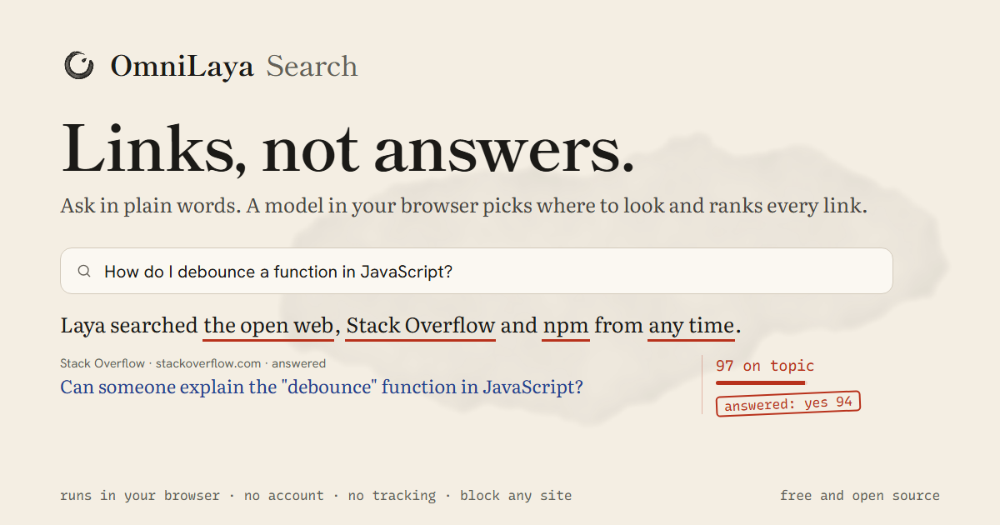

# OmniLaya Search

**Links, not answers.** Ask in plain words, and a small model running in your browser picks where to look and ranks every link. No AI answer, no account, no tracking.

[](https://omnilaya.pages.dev/)

**Try it: [omnilaya.pages.dev](https://omnilaya.pages.dev/)** · [How it works and privacy](https://omnilaya.pages.dev/about)

## Why OmniLaya

Search pages and chat tools now put a generated answer first. When you need the actual page (the docs, the repo, the package, the thread), you still dig for the link and check whether it is real. In Pew's 2025 study, people clicked a search result on 8% of visits when Google showed an AI summary, against 15% without one, and clicked a link inside the summary on 1% ([Pew Research](https://www.pewresearch.org/short-reads/2025/07/22/google-users-are-less-likely-to-click-on-links-when-an-ai-summary-appears-in-the-results/)). For code it is riskier: a 2024 study found that at least 5.2% of packages suggested by commercial code models, and 21.7% by open-source ones, did not exist ([Spracklen et al.](https://arxiv.org/abs/2406.10279)).

What people keep asking for in developer forums is simple: "just give me the links", let me block sites I do not trust, and do not make me sign up or pay. That is what OmniLaya does:

- **Just the links.** No generated answer, so there is nothing made up to check. You read the sources and judge them yourself.
- **The right places, picked for you.** Laya reads your request and decides where to look: the open web, GitHub, npm, Stack Overflow, Hacker News, research papers, books or Wikipedia. A package or repo in the results is a real entry from that registry.
- **You set the rules.** Block, raise or lower any site. Hide results below a score you choose. Ask a yes or no question ("Is this official documentation?") and every result is stamped with Laya's answer.
- **Private and free.** Laya runs in your browser tab and your search goes straight to the sources. There is no OmniLaya server, account or analytics. It is a static site under the MIT license, so anyone can host a copy.

**What it does not do well yet:** the open web index ([Mwmbl](https://mwmbl.org)) is small, so OmniLaya is better at finding developer sources than at general web search, and it is not a Google replacement. Reddit, X and arXiv do not allow searches from a browser. The first visit downloads Laya once (614 MB), and it is fast only with WebGPU, so a desktop browser works best.

## About the model

[Laya](https://github.com/NandhaKishorM/laya) is a small non-autoregressive decision model from Convai Innovations. It answers typed questions (`choice`, `score`, `noul`) about a piece of text in one forward pass and never writes text, so every decision on the page is a probability you can see.

OmniLaya Search started as a port of [Jev Search](https://github.com/superagents-lab/jev-search) (MIT) from TypeSafe's Jev to Laya. It is an independent project, not an official Convai Innovations or Search1API product.

## Two ways to run it

| | **OmniLaya on your device** (`local/`) | **OmniLaya server** (`src/`) |
| --- | --- | --- |
| Where Laya runs | In the reader's browser (WebGPU), downloaded once (614 MB) | On a `laya-serve` you host |
| Search sources | Keyless open APIs, called from the browser | Search1API or SearXNG |
| Hosting | Any static host; live on Cloudflare Pages | Cloudflare Workers plus a Laya server |
| Cost | Free | Free to a few dollars, see [DEPLOY.md](DEPLOY.md) |
| Privacy | Requests go only to the sources; there is no OmniLaya server | Requests pass through your Worker and Laya server |

### OmniLaya on your device

The static app searches the open web (the [Mwmbl](https://mwmbl.org) index), Wikipedia, Hacker News, GitHub, Stack Overflow, research papers ([OpenAlex](https://openalex.org)), Open Library and npm, straight from the browser. Laya runs in a Web Worker on WebGPU (fp16) through Transformers.js, using the [ONNX conversion](https://huggingface.co/onnx-community/laya-multilingual-ONNX) of the multilingual checkpoint and a runtime adapted from [open-jev](https://github.com/shreyaskarnik/open-jev) (MIT). It asks Laya the same questions as the server app, with the state serialized the way `laya-serve` does.

Before the reader brings Laya to the device, searches work by rule (the places a request names, else the open web and Wikipedia, in engine order). After the one-time download, Laya chooses the places and time window and scores every result on the device; later visits load it from the browser cache.

```bash
pnpm dev:local     # http://localhost:3040
pnpm build:local   # static files in dist-local/
```

Measured on a Snapdragon laptop (Adreno GPU, Chrome): reading a request 0.2 to 0.4 s, judging 8 to 16 results 0.8 to 1.3 s, a full page 1.7 to 3 s; reopening the tab to judged results 8 s from cache. Browsers without WebGPU fp16 fall back to the CPU and a 1.3 GB fp32 download, which is slow. Reddit, arXiv and X refuse browser requests, so the static app cannot search them.

To publish: `pnpm deploy:local` builds `dist-local/` and uploads it to the Cloudflare Pages project `omnilaya` (log in once with `npx wrangler login`). Any other static host works too: serve `dist-local/` and set `SITE_URL` to its address when building, so share links and the sitemap point at it.

## How the server app works

1. **Understand.** Laya answers two choice questions about your request in one call: how recent the results should be, and where to search (the open web, Hacker News, Reddit, GitHub, X, arXiv, Wikipedia, IMDb, WeChat or YouTube). Each place Laya gives at least 35% of its choice is searched. As on Jev Search, a platform the request names ("on Hacker News", "Reddit users") is searched on its own, and a platform Laya infers without a name ("new papers" means arXiv) is searched together with the three web engines. When no place stands out, the web engines answer. The page writes this as one sentence ("Laya searched Google, DuckDuckGo and Yandex from any time."); tap a place to strike it out, a struck place to bring it back, or the time to change it.
2. **Search.** Google, DuckDuckGo and Yandex search the open web. Hacker News, Reddit and GitHub each combine a Google site-restricted search with their own engine. X, arXiv, YouTube, Wikipedia, IMDb and WeChat use vertical engines. Calls run concurrently; one failed engine does not discard another engine's results.
3. **Rank.** Laya scores each result for relevance. Results are merged by URL, ordered by relevance, engine agreement and original rank, and streamed as each lane finishes. Results Laya puts below the cutting floor (25% by default, adjustable with a slider) fold away under it. A failed source shows a warning rather than a zero-result count.

Try "Rust async runtimes on Hacker News this month", "What do Reddit users think of the Framework laptop?" or "New papers on speculative decoding". The last one names no source or time and lets Laya choose arXiv.

### Proofing the page

The results page treats Laya as an editor marking a printed page. Its scores sit in a margin column beside each result, in vermilion. On top of that:

- **Ask Laya about these results.** Type your own yes/no question ("Is this official documentation?"). Laya answers it for every result above the cutting floor through `POST /api/judge`; the answer is stamped in the margin, and you can sort by it or keep only the yeses. Each result is asked as its own state, with where it came from, and the reader's question as the question: on 133 live results across six questions this separated yes from no with an AUC of 0.75 (70% right at 0.5), against 0.56 (40%) with the result written into the question. Calibrating against an empty result made it worse. The test harness is `local/src/dev/ask-eval.ts`.
- **Disagree stamp.** Mark a result Laya judged wrongly. Stamps stay in this browser and export as JSONL for labelled data.
- **Lenses.** Raise, lower or block a domain, or save the current places as a lens to apply to any search. Stored locally.
- **Keyboard.** `j`/`k` move between results, `o` opens, `x` folds, `d` stamps a disagreement, `e` edits the sentence, `/` asks.
- **Colophon.** The page ends with how it was made: where Laya looked, the checkpoint, timings and the query sent.

The design system is in [DESIGN.md](DESIGN.md).

### Why the questions look the way they do

The Laya questions were chosen by running them against a real `laya-serve` (Laya 0.3.20, English and multilingual checkpoints), not copied from Jev Search:

- **One "where to search" choice instead of a yes or no per source.** Asked twelve separate yes or no questions, zero-shot Laya put almost every source near 50%. Asked one choice question, it gave the named or implied place 0.9 or more (Hacker News 0.96, Reddit 0.99, arXiv 1.00, IMDb 0.94) and spread its probability thinly on general questions, which reads as "use the open web".
- **The result goes in the question, the request is the state.** Laya reads the question and the state in one encoder window of 512 tokens (English checkpoint) and cuts the state from the right, so a state holding 40 results hides the later ones. With each result written into its own question and the request as the shared state, Laya separated on-topic from off-topic results on a labelled set with an AUC of 1.00, against 0.70 for a result-in-state wording, and one request covers a whole lane.
- **The keyword query is chosen by rule.** Asked to pick the best rewrite of the request, Laya chose the untouched request almost every time, which would send words like "on Hacker News this month" to the engines. The code strips time, source and filler words and sends that; the proper nouns go to catalogue engines such as IMDb.
- **No date in the state.** Laya reads "this month" or "today" from the words and does no date arithmetic; adding the date moved "recently" from the past week to the past day.
- **Each URL is scored once per search.** `laya-serve` runs one forward pass at a time, so a URL returned by several engines is judged once and shared.

Model choices and provider coverage can vary. Laya's own [benchmarks](https://github.com/NandhaKishorM/laya/blob/main/BENCHMARKS.md) list where it trails other models.

### The stream

The application streams newline-delimited JSON from `POST /api/ask`: `intent` (including `judge`, the Laya provider that answered, and `checkpoint`, the Laya checkpoint that read the request), `found` (progress counts), `lane` (ranked results) and `done`. Each engine has a 15-second deadline within an overall 30-second request deadline. Google starts speculatively with the final query while Laya reads the request. Successful, non-empty engine responses are cached for 10 minutes to 6 hours, depending on the time window.

The optional `s` source list is capped at the number of supported sources (currently 12 entries before filtering). Longer lists return HTTP 400 before any provider calls. Repeated valid sources are merged, preserving their first occurrence, so repeating a source cannot multiply search or ranking calls.

## Local development

Requires Node.js 22.12+, pnpm 10.8.0, Python 3.10+ for Laya, and an API key from [Search1API](https://www.search1api.com).

Start Laya first. It downloads the checkpoints from Hugging Face on first run:

```bash
python -m venv .venv
.venv/bin/python -m pip install "laya[serve]"
LAYA_DEVICE=cpu LAYA_MODELS=english,multilingual .venv/bin/laya-serve   # http://127.0.0.1:8000
```

On Windows use `.venv\Scripts\python.exe` and `.venv\Scripts\laya-serve.exe`, and set the variables with `$env:LAYA_DEVICE = 'cpu'` in PowerShell. Laya's repository also ships a Docker Compose file for the server (`compose.http.yaml`). A GPU (`LAYA_DEVICE=cuda`) answers in tens of milliseconds; a laptop CPU takes a few seconds per search.

Then the app:

```bash
git clone https://github.com/Hotragn/Omni-Laya.git
cd Omni-Laya
corepack enable
pnpm install --frozen-lockfile
cp .dev.vars.example .dev.vars
# Set SEARCH1API_API_KEY in .dev.vars. LAYA_BASE_URL already points at http://127.0.0.1:8000.
pnpm dev
```

Open http://localhost:3030. Local development uses local KV and rate-limit bindings. Keep `.dev.vars` private; it is ignored by Git. `.env.example` is a variable reference; `.dev.vars` is the documented local configuration.

```bash
pnpm generate-routes
pnpm cf-typegen
pnpm test
pnpm build
pnpm exec wrangler deploy --dry-run
```

Tests mock providers and do not need API keys or a running Laya. Building does not call any provider. `worker-configuration.d.ts` is generated from the Wrangler configuration and `.dev.vars.example`; regenerate it after changing bindings or secrets.

Cloudflare's local runtime (`workerd`) has no build for Windows on ARM64. On those machines run the pnpm commands with an x64 build of Node.js, which Windows runs under emulation.

## Deploy to Cloudflare Workers

**For a free deployment with one command per machine, follow [DEPLOY.md](DEPLOY.md):** Laya and a SearXNG search backend on Oracle Cloud's Always Free server, and the site on Cloudflare's free plan via `pnpm deploy:free`. The steps below are the manual equivalent.

The application uses TanStack Start, React and the Cloudflare Vite plugin. You need a Cloudflare account with Workers and KV enabled, and a `laya-serve` reachable from the internet (a VM, a container host or a Hugging Face Inference Endpoint). Set `LAYA_API_KEY` on that server so it is not open to anyone.

1. Run `pnpm exec wrangler login`.
2. In `wrangler.jsonc`, choose a Worker `name`, and add a `routes` entry if you serve a custom domain. Update the origin in `src/lib/seo.ts`, `public/robots.txt` and `public/sitemap.xml` to match your deployment.
3. Run `pnpm exec wrangler kv namespace create omnilaya-search-cache` and put the returned ID in the `CACHE` binding.
4. Choose a unique rate-limit `namespace_id` in your account. The default limit is 10 searches per IP per minute per Cloudflare location; it is not a global spending cap. `CACHE` and `SEARCH_RATE_LIMIT` are optional; regenerate types after changing bindings.
5. Upload your secrets and deploy:

```bash
pnpm exec wrangler secret put SEARCH1API_API_KEY
pnpm exec wrangler secret put LAYA_BASE_URL     # e.g. https://laya.example.com
pnpm exec wrangler secret put LAYA_API_KEY      # the key your laya-serve checks
pnpm cf-typegen
pnpm test
pnpm run deploy:dry-run
pnpm run deploy
```

Provider keys stay in Cloudflare secrets and are never included in the browser bundle. Each search makes one Laya call to read the request, one per engine lane to score results, and several billable Search1API calls. The same-origin check is a browser boundary, not authentication.

### Laya providers

Every provider is a `laya-serve` speaking `POST /v1/systemone`. They differ in where the server runs and how it is authenticated. Any one is enough; the other is an optional fallback.

| Provider | Where it runs | What it needs |
| --- | --- | --- |
| `laya` | A `laya-serve` you run (laptop, VM, container) | `LAYA_BASE_URL`, plus `LAYA_API_KEY` if the server sets one |
| `huggingface` | A Hugging Face Inference Endpoint running the `laya-serve` container from Laya's Dockerfile | `HF_ENDPOINT_URL` and `HF_TOKEN` |

| Variable | Kind | Default | Meaning |
| --- | --- | --- | --- |
| `SEARCH_PROVIDER` | secret, optional | `search1api` | Search backend for the engine lanes: `search1api`, or `searxng` for a self-hosted SearXNG. |
| `SEARCH1API_API_KEY` | secret | | Search1API key used for every engine call. Required with `search1api`. |
| `SEARXNG_BASE_URL` | secret | | SearXNG address. Required with `searxng`. SearXNG has no X engine and no Reddit engine; Reddit uses its Google lane. |
| `SEARXNG_API_KEY` | secret | | Bearer key checked by the proxy in front of SearXNG (`deploy/server` sets one up). |
| `LAYA_PROVIDERS` | secret, optional | `laya` | Enabled providers in order of preference, comma-separated, e.g. `laya,huggingface`. Unlisted providers stay off even when their settings exist. The first configured provider is primary; the rest are fallbacks. |
| `LAYA_BASE_URL` | secret | | Base URL of your `laya-serve`. |
| `LAYA_API_KEY` | secret | | Bearer key, only when that server sets `LAYA_API_KEY`. |
| `HF_ENDPOINT_URL` | secret | | Inference Endpoint URL. |
| `HF_TOKEN` | secret | | Hugging Face token with access to that endpoint. |
| `LAYA_MODEL` | var | empty | Empty lets `laya-serve` route each request to the English or multilingual checkpoint by script and language. Set `english`, `multilingual` or `typed-decisions` to pin one. |

A request moves to the next provider when the current one is unreachable, or answers HTTP 429 or 5xx (including 503 from an Inference Endpoint that is scaling up). Client errors such as 400, 401, 413 or 422 are not retried, and nothing is retried after the request is cancelled. Each hop is logged as `[laya] <provider> returned HTTP <status>; retrying with <next>`, and the `intent` event's `judge` field names the provider that answered.

Laya's `confidence` on choice answers is 1 minus normalised entropy, not a rescaled top probability, so thresholds taken from other models do not carry over. OmniLaya's thresholds (35% for a place, 25% for on topic) come from the probes described above; revisit them if you fine-tune Laya or pin a different checkpoint.

`.dev.vars.example` lists every secret and is also the input for `pnpm cf-typegen`. Add new secrets there first.

GitHub Actions validates pull requests and pushes with tests, type generation and a production build. For Cloudflare's Git integration, use these settings:

| Setting | Value |
| --- | --- |
| Root directory | Repository root (`/`) |
| Production branch | `main` |
| Build command | `pnpm run build` |
| Deploy command | `pnpm exec wrangler deploy` |
| Node.js version | 22.12+ |

## Data and limitations

- Search requests go to Search1API and to the `laya-serve` you configured. Laya also receives result titles and snippets for relevance scoring. With the `huggingface` provider, that traffic goes to your Hugging Face endpoint.
- Cloudflare KV stores query-derived cache keys and result snippets for the configured TTL. Removing `CACHE` disables this cache.
- The application does not record search text, inferred queries or result clicks, and ships no analytics.
- The rate limiter uses the client IP. Cloudflare Workers request logging is enabled in the configuration; invocation logs include request URLs, which may contain the search query.
- The page loads fonts from Google Fonts. Result links lead to third-party sites.
- Production builds register a service worker so the app can be installed. It intercepts only top-level navigations when the network fails, and never `/api/ask` or `/api/judge`.
- `/search` pages send `noindex, follow`; the sitemap lists only the homepage.
- Ask Laya sends your question and the titles and snippets on screen to your `laya-serve`. Lens rules, saved lenses, the cutting floor and disagreement stamps live in the browser's local storage and are never sent anywhere.
- Relevance percentages are model judgments, not verified accuracy. Laya's shipped checkpoints are uncalibrated for this task, and a laptop CPU makes searches take several seconds. Snippets may be incorrect, incomplete or stale. Date filtering and Newest sorting prefer Search1API's `published_date`, falling back to snippet dates.

## Project layout

| Path | Responsibility |
| --- | --- |
| `src/lib/sources.ts` | Sources, engine lanes, Laya's places and time windows |
| `src/lib/candidates.ts` | Keyword query and catalogue query from the request |
| `src/lib/laya.ts` | Laya client, provider chain and the two judgments |
| `src/lib/judge-config.ts` | Provider chain built from environment variables |
| `src/lib/search1api.ts`, `searxng.ts`, `search-config.ts` | Search backends, engine deadlines and backend choice |
| `src/lib/pipeline.ts` | Concurrent search and ranking stream |
| `src/lib/cache.ts` | Per-engine response cache |
| `src/lib/rank.ts`, `merge.ts` | Ordering, grouping and URL deduplication |
| `src/lib/use-ask.ts` | Client stream consumer |
| `src/routes/api/ask.ts`, `judge.ts` | Search endpoint and Ask Laya endpoint, with origin validation and rate limiting |
| `src/components/decision-sentence.tsx`, `results.tsx`, `ask-laya.tsx`, `colophon.tsx` | The results page: editable decision sentence, margin marks and cutting floor, Ask Laya, colophon |
| `src/lib/proof.ts`, `use-proofs.ts`, `use-ask-laya.ts` | Reader marks kept in local storage, and the Ask Laya client |
| `brand/` | Logo generator, brand kit and guidelines |
| `deploy/server/`, `deploy/modal/`, `scripts/deploy-cloudflare.mjs` | Deployment: Laya, SearXNG and Caddy on one server, or Laya as a serverless endpoint on Modal; one-command Cloudflare deploy |
| `src/lib/judgment-cache.ts` | Caches Laya's judgments per request so repeated searches skip the model |
| `local/` | The static, in-browser app: Laya runtime and worker, keyless sources, pipeline and UI |
| `test/` | Provider-independent regression tests |

See [CONTRIBUTING.md](CONTRIBUTING.md) for development guidelines, [SECURITY.md](SECURITY.md) for vulnerability reporting and [brand/README.md](brand/README.md) for the brand.

## License and attribution

Application code is [MIT licensed](LICENSE). It is derived from Jev Search by Search1API, also MIT; that copyright notice is kept in `LICENSE`.

Laya and its checkpoints are Apache 2.0, by Convai Innovations ([code](https://github.com/NandhaKishorM/laya), [weights](https://huggingface.co/convaiinnovations/laya)). The server app calls Laya over HTTP; the static app downloads the ONNX conversion by [@shreyask](https://huggingface.co/onnx-community/laya-multilingual-ONNX) into the reader's browser. Neither includes the weights. `local/src/laya/runtime.ts` is adapted from [open-jev](https://github.com/shreyaskarnik/open-jev) (MIT, Nico Martin and contributors). Laya, Search1API and the engine names belong to their owners.

The OmniLaya mark, wash and icons are generated by `brand/make_logo.py`. Source icons use [Simple Icons](https://simpleicons.org); Google uses the four-colour G and Yandex the 2021 mark. Interface icons use [Lucide](https://lucide.dev).
